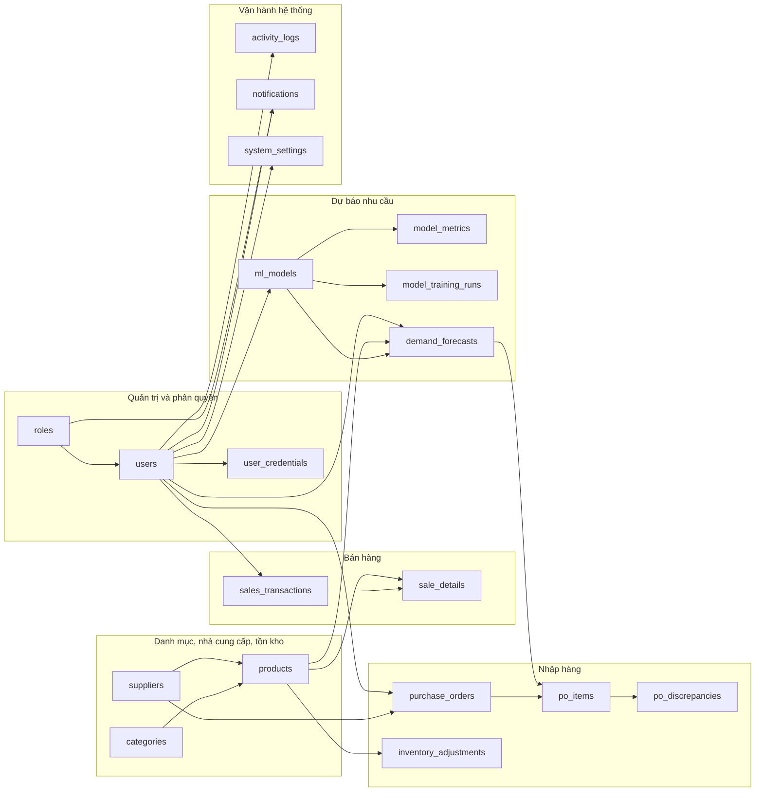
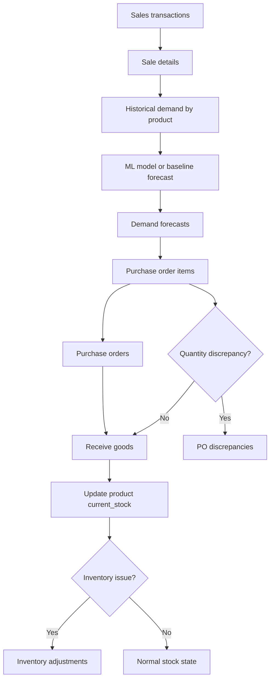

# ForecastAI Database V3 Diagram

Nguồn schema: `backend/src/models/database_v3.sql`  
Database: `forecastai_v3`

## ERD tổng quan

```mermaid
erDiagram
    ROLES {
        int role_id PK
        varchar role_name UK
        varchar description
        timestamp created_at
    }

    USERS {
        int user_id PK
        varchar full_name
        varchar email UK
        varchar phone
        int role_id FK
        boolean is_active
        timestamp created_at
        timestamp updated_at
    }

    USER_CREDENTIALS {
        int credential_id PK
        int user_id FK_UK
        varchar username UK
        varchar password_hash
        timestamp password_updated_at
        timestamp last_login_at
        int failed_login_attempts
        timestamp locked_until
    }

    CATEGORIES {
        int category_id PK
        varchar name UK
        text description
        timestamp created_at
    }

    SUPPLIERS {
        int supplier_id PK
        varchar name
        varchar contact_name
        varchar phone
        varchar email
        text address
        int lead_time_days
        timestamp created_at
    }

    PRODUCTS {
        int product_id PK
        varchar sku UK
        varchar name
        int category_id FK
        int supplier_id FK
        varchar unit
        decimal cost_price
        decimal selling_price
        int current_stock
        int min_stock_level
        int max_stock_level
        boolean is_discontinued
        timestamp created_at
        timestamp updated_at
    }

    SALES_TRANSACTIONS {
        int transaction_id PK
        varchar transaction_code UK
        datetime transaction_date
        decimal total_amount
        decimal discount_amount
        int created_by FK
        timestamp created_at
    }

    SALE_DETAILS {
        int detail_id PK
        int transaction_id FK
        int product_id FK
        int quantity
        decimal unit_price
        decimal line_total
    }

    ML_MODELS {
        int model_id PK
        varchar version_tag UK
        varchar model_path
        varchar algorithm_type
        timestamp training_date
        json hyperparameters
        boolean is_deployed
        int created_by FK
    }

    MODEL_METRICS {
        int metric_id PK
        int model_id FK
        float mae_score
        float rmse_score
        float r2_score
        varchar test_data_range
        timestamp created_at
    }

    MODEL_TRAINING_RUNS {
        int run_id PK
        int candidate_model_id FK
        int baseline_model_id FK
        enum run_status
        varchar trigger_type
        timestamp started_at
        timestamp finished_at
        date train_data_start
        date train_data_end
        date validation_period
        int training_rows
        int validation_rows
        float baseline_mape
        float candidate_mape
        float improvement_percent
        boolean deployed
        varchar deploy_reason
        text error_message
        int created_by FK
    }

    DEMAND_FORECASTS {
        int forecast_id PK
        int product_id FK
        int model_id FK
        timestamp forecast_date
        date target_period
        int predicted_quantity
        int lower_bound
        int upper_bound
        int recommended_order
        int created_by FK
    }

    PURCHASE_ORDERS {
        int po_id PK
        varchar po_code UK
        int supplier_id FK
        int created_by FK
        int approved_by FK
        enum status
        datetime order_date
        date expected_delivery_date
        datetime received_date
        decimal total_value
        text staff_note
        timestamp created_at
        timestamp updated_at
    }

    PO_ITEMS {
        int po_item_id PK
        int po_id FK
        int product_id FK
        int forecast_id FK
        int forecasted_quantity
        int ordered_quantity
        int received_quantity
        decimal unit_cost
        decimal line_total
    }

    PO_DISCREPANCIES {
        int discrepancy_id PK
        int po_item_id FK
        int po_id FK
        int expected_quantity
        int actual_quantity
        int discrepancy_quantity
        varchar reason
        text evidence_url
        enum status
        int reported_by FK
        int resolved_by FK
        text resolution_note
        timestamp created_at
        timestamp updated_at
    }

    INVENTORY_ADJUSTMENTS {
        int adjustment_id PK
        int product_id FK
        enum adjustment_type
        int quantity
        varchar reason
        text evidence_url
        enum status
        int reported_by FK
        int resolved_by FK
        text resolution_note
        timestamp created_at
        timestamp updated_at
    }

    ACTIVITY_LOGS {
        int log_id PK
        int user_id FK
        varchar action
        varchar entity_type
        int entity_id
        text description
        varchar ip_address
        timestamp created_at
    }

    NOTIFICATIONS {
        int notification_id PK
        int user_id FK
        int role_id FK
        varchar title
        text message
        enum type
        varchar entity_type
        int entity_id
        varchar link
        boolean is_read
        timestamp created_at
        timestamp read_at
    }

    SYSTEM_SETTINGS {
        int setting_id PK
        varchar setting_key UK
        text setting_value
        varchar setting_type
        varchar description
        int updated_by FK
        timestamp updated_at
    }

    ROLES ||--o{ USERS : "role_id"
    USERS ||--o| USER_CREDENTIALS : "user_id"
    CATEGORIES ||--o{ PRODUCTS : "category_id"
    SUPPLIERS ||--o{ PRODUCTS : "supplier_id"

    USERS ||--o{ SALES_TRANSACTIONS : "created_by"
    SALES_TRANSACTIONS ||--o{ SALE_DETAILS : "transaction_id"
    PRODUCTS ||--o{ SALE_DETAILS : "product_id"

    USERS ||--o{ ML_MODELS : "created_by"
    ML_MODELS ||--o{ MODEL_METRICS : "model_id"
    ML_MODELS ||--o{ MODEL_TRAINING_RUNS : "candidate_model_id"
    ML_MODELS ||--o{ MODEL_TRAINING_RUNS : "baseline_model_id"
    USERS ||--o{ MODEL_TRAINING_RUNS : "created_by"
    PRODUCTS ||--o{ DEMAND_FORECASTS : "product_id"
    ML_MODELS ||--o{ DEMAND_FORECASTS : "model_id"
    USERS ||--o{ DEMAND_FORECASTS : "created_by"

    SUPPLIERS ||--o{ PURCHASE_ORDERS : "supplier_id"
    USERS ||--o{ PURCHASE_ORDERS : "created_by"
    USERS ||--o{ PURCHASE_ORDERS : "approved_by"
    PURCHASE_ORDERS ||--o{ PO_ITEMS : "po_id"
    PRODUCTS ||--o{ PO_ITEMS : "product_id"
    DEMAND_FORECASTS ||--o{ PO_ITEMS : "forecast_id"

    PO_ITEMS ||--o{ PO_DISCREPANCIES : "po_item_id"
    PURCHASE_ORDERS ||--o{ PO_DISCREPANCIES : "po_id"
    USERS ||--o{ PO_DISCREPANCIES : "reported_by"
    USERS ||--o{ PO_DISCREPANCIES : "resolved_by"
    PRODUCTS ||--o{ INVENTORY_ADJUSTMENTS : "product_id"
    USERS ||--o{ INVENTORY_ADJUSTMENTS : "reported_by"
    USERS ||--o{ INVENTORY_ADJUSTMENTS : "resolved_by"

    USERS ||--o{ ACTIVITY_LOGS : "user_id"
    USERS ||--o{ NOTIFICATIONS : "user_id"
    ROLES ||--o{ NOTIFICATIONS : "role_id"
    USERS ||--o{ SYSTEM_SETTINGS : "updated_by"
```

## Nhóm chức năng



## Luồng dữ liệu chính



## Ghi chú quan hệ

- Các khóa ngoại có `ON DELETE SET NULL` trong SQL được thể hiện như quan hệ tùy chọn ở phía bảng con, ví dụ `created_by`, `approved_by`, `updated_by`, `forecast_id`.
- `user_credentials.user_id` là FK đồng thời `UNIQUE`, nên mỗi user có tối đa một bản ghi đăng nhập.
- `sale_details`, `po_items`, `po_discrepancies` dùng `ON DELETE CASCADE` ở các quan hệ cha chính, phù hợp với dữ liệu chi tiết phụ thuộc header.
- `notifications` có thể gửi theo `user_id` cụ thể hoặc theo `role_id`.
